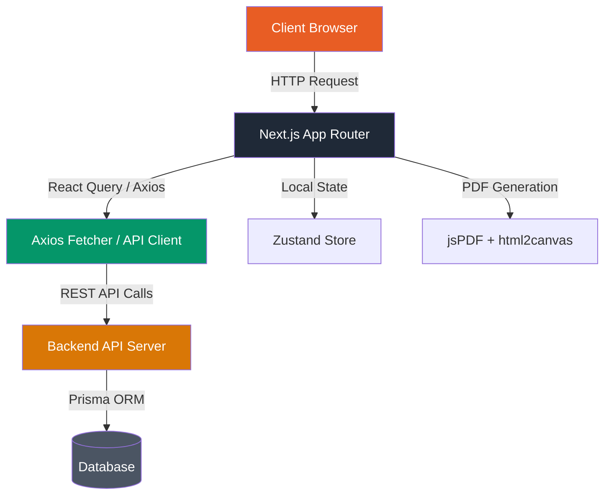
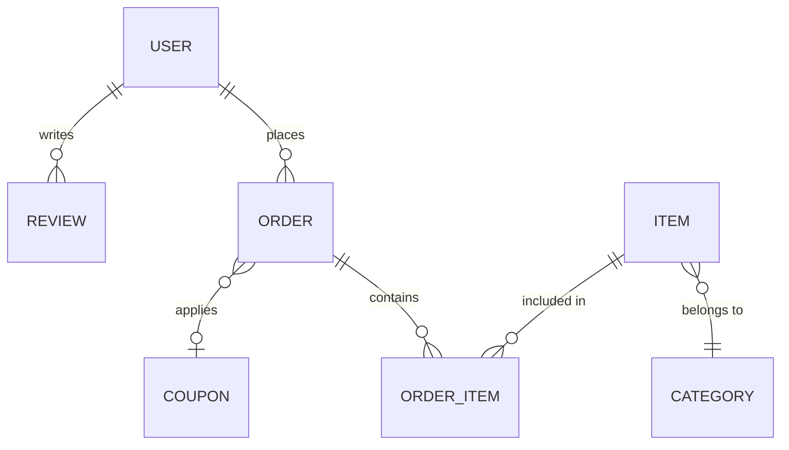

# 🪵🔥 Lakri Chulay Ranna Client

[](https://nextjs.org/)
[](https://react.dev/)
[](https://tailwindcss.com/)
[](https://www.typescriptlang.org/)
[](https://tanstack.com/query)
[](https://www.framer.com/motion/)
[](https://zustand-demo.pmnd.rs/)
[](https://ui.shadcn.com/)

**Lakri Chulay Ranna (লাকড়ি চুলায় রান্না)** is a modern, premium e-commerce platform for traditional wood-fired Bangladeshi cuisine. This repository contains the **Frontend Client**, built using Next.js 16 App Router, React 19, and Tailwind CSS v4 to deliver high performance, visual excellence, and smooth user interactions — from dish discovery to seamless Cash on Delivery checkout. It features a complete public storefront, customer order tracking dashboard, and an administrative panel with analytical insights, order fulfillment workflows, and content management.

---

## Backend Repository

[Backend Repository](https://github.com/sayed725/lakrichulayranna-backend)

## Live Page & Socials
[Facebook Page](https://www.facebook.com/lakrichulayranna)

---

## 📖 Table of Contents

1. [Technical Architecture](#️-technical-architecture)
2. [Feature Ecosystem](#-feature-ecosystem)
3. [Order & Delivery Address System](#-order--delivery-address-system)
4. [User Personas & Journeys](#-user-personas--journeys)
5. [Data Flow Diagram](#-data-flow-diagram)
6. [Core Development Principles](#️-core-development-principles)
7. [Folder Architecture](#-folder-architecture)
8. [Setup & Configuration](#-setup--configuration)
9. [Key API Integrations](#-key-api-integrations)

---

## 🏗️ Technical Architecture

The application is structured using a **Feature & Modular Component Architecture** powered by Next.js 16 App Router. Route groups separate public guest access, customer accounts, and protected administrator portals while maintaining a unified design system.

### Core Stack

| Layer | Technology | Purpose |
|---|---|---|
| **Framework** | Next.js 16 (App Router) | SSR, SSG, and file-based routing |
| **Core UI** | React 19 | UI components with hooks & concurrent rendering |
| **Styling** | Tailwind CSS v4 + Shadcn/UI | Modern styling with custom warm color tokens & Radix primitives |
| **Language** | TypeScript 5 | End-to-end static type safety |
| **State Management** | Zustand | Persistent cart store & local UI state |
| **Data Fetching** | TanStack React Query v5 | Server state management, caching, background updates |
| **Animations** | Framer Motion | Smooth page transitions, micro-interactions & entrance effects |
| **Form Management** | React Hook Form + Zod v4 | Schema-driven form validation |
| **Charts & Analytics** | Recharts | Admin sales and revenue data visualizations |
| **Carousel** | Embla Carousel | Banner slider & featured item showcases |
| **PDF Generation** | jsPDF + html2canvas | Client-side invoice rendering and download |
| **Notifications** | Sonner & React Hot Toast | Toast notification system |
| **HTTP Client** | Axios | Custom API fetcher with interceptors |

---

## 🌟 Feature Ecosystem

### 🌐 Public Storefront

- **Dynamic Hero Banners**: High-impact banner sliders with promotional highlights and category navigation.
- **Menu & Category Browsing**: Filter wood-fired dishes by categories with responsive sidebar and grid controls.
- **Product Details**: Multi-image view, dish weights, spice indicators, and related menu items.
- **Customer Reviews**: Verified customer feedback on dishes with rating badges.
- **Interactive Cart Drawer**: Slide-out cart with item quantities, dynamic subtotal calculations, and instant checkout link.
- **SEO & Localization**: Benglish/Bengali typography optimized with custom font support, dynamic title tags, and meta descriptions.

### 🛒 Shopping & Checkout Experience

- **Smart Cart Persistence**: Zustand store with local storage sync for reliable shopping cart persistence across browser reloads.
- **Flexible Address Entry**: Plain-text flexible address input with automatic delivery region calculation (Dhaka city vs. Outside Dhaka).
- **Weight-Based Delivery Charge**: Dynamic delivery charge calculation taking base area rate + weight surcharges (e.g. extra charges above 1kg).
- **Coupon Validation**: Real-time coupon application with subtotal validation and instant discount subtraction.
- **Cash on Delivery (COD)**: Seamless checkout experience optimized for local order fulfillment.
- **Guest & Customer Order Tracking**: Real-time status updates (`PENDING` → `CONFIRMED` → `PREPARING` → `READY` → `DELIVERED` / `CANCELLED`).
- **Instant PDF Invoices**: Client-side HTML-to-canvas PDF invoice builder with Bengali text shaping support.

### 🛡️ Admin & Customer Dashboard

- **Sales Analytics**: Revenue totals, order stats, user acquisition metrics, and interactive charts via Recharts.
- **Menu Item Management**: Create, update, toggle availability, and upload main/secondary images for menu items.
- **Category Manager**: Organize food categories with image assets and active toggles.
- **Order Pipeline**: Process incoming orders, advance fulfillment stages, edit order details, cancel orders, or create manual phone orders.
- **Coupon Manager**: Create discount codes with usage limits, expiration dates, and min-order constraints.
- **Banner Manager**: Manage hero carousel banners with CTA links and custom ordering.
- **Review Moderation**: Review and approve customer feedback before public display.

---

## 🚚 Order & Delivery Address System

The checkout payload and order processing validation use a flexible `{ area, address }` address structure to simplify customer checkout while maintaining backend compatibility.

```json
{
  "deliveryAddress": {
    "area": "Dhaka",
    "address": "House 12, Road 5, Block B, Mirpur, Dhaka"
  }
}
```

- **Frontend Input**: Takes a plain-text input field (minimum 5 characters) without forcing strict street/city field formatting.
- **Invoice Rendering**: The invoice generator (`generateInvoicePDF.ts`) and modal components safely extract address strings from `address`, `street`, or legacy string formats, applying `[overflow-wrap:anywhere]` and `break-words` CSS to prevent UI text overflow on long addresses.

---

## 👥 User Personas & Journeys

### 1. The Customer Journey

```
Browse Dishes → Add to Cart → Select Delivery Area → Input Address → Confirm Order (COD) → Track Status → Download PDF Invoice
```

- Discovers authentic Bangladeshi food via category listings and hero banners.
- Adds items to cart and applies promotional coupons.
- Enters delivery location and views dynamic delivery charges.
- Receives immediate order number confirmation with real-time status tracking.

### 2. The Admin Journey

```
Login → Analytics Dashboard → Process Pending Orders → Manage Menu Items → Configure Coupons & Banners
```

- Monitors daily revenue and order metrics.
- Updates order status along the preparation pipeline (`PENDING` → `PREPARING` → `DELIVERED`).
- Adds new wood-fired dishes with pricing, weight, and image metadata.

---

## 📊 Data Flow Diagram



### Entity Overview



---

## 🛠️ Core Development Principles

1. **Type Safety**: End-to-end TypeScript interfaces matching backend DTO schemas.
2. **Resilient Address Parsing**: Safe fallback parsing for `deliveryAddress` across legacy plain strings and structured JSON objects.
3. **Optimistic & Fast Data Fetching**: TanStack React Query handles client-side caching, background revalidation, and error handling.
4. **Responsive Layouts**: Designed for mobile browsers and desktop admin views with zero text overflow.
5. **Bengali Typography Support**: HTML2Canvas invoice generation preserves Bengali text shaping during PDF export.

---

## 📂 Folder Architecture

```text
src/
├── app/                              # Next.js App Router pages
│   ├── (public)/                     # Public storefront routes
│   │   ├── page.tsx                  # Landing homepage
│   │   ├── menu/                     # Food menu catalog
│   │   ├── cart/                     # Cart review
│   │   ├── checkout/                 # Order placement page
│   │   ├── order/[orderNumber]/      # Order tracking & receipt
│   │   └── my-orders/                # Customer order history
│   ├── dashboard/                    # Admin & Customer dashboard
│   │   ├── admin/                    # Admin management pages (orders, items, stats)
│   │   └── customer/                 # Customer dashboard
│   └── layout.tsx                    # Root layout & providers
├── components/                       # UI components
│   ├── cart/                         # Cart items & drawer components
│   ├── dashboard/                    # Dashboard cards & timelines
│   ├── forms/                        # Reusable FormInput & FormTextarea
│   ├── modals/                       # ViewOrderModal, CreateOrderModal, EditOrderModal
│   ├── shared/                       # Navbar, Footer, Container
│   └── ui/                           # Base UI components (Radix / Shadcn)
├── features/                         # Feature-specific hooks & services
│   ├── cart/                         # Coupon validation hooks
│   ├── item/                         # Item hooks
│   ├── order/                        # Order placement hooks
│   └── review/                       # Customer review hooks
├── lib/                              # Utility functions & API fetcher
│   ├── constants.ts                  # API routes & constants
│   ├── fetcher.ts                    # Axios wrapper & base URLs
│   ├── generateInvoicePDF.ts         # Client-side PDF generator
│   └── utils.ts                      # Price formatter & class merger
├── store/                            # Zustand state stores
│   ├── auth.store.ts                 # Authentication state
│   ├── cart.store.ts                 # Cart persistence store
│   └── coupon.store.ts               # Applied coupon state
└── types/                            # Global TypeScript types
```

---

## 🚀 Setup & Configuration

### Prerequisites

- **Node.js** v18+
- **npm** or **pnpm**
- Running instance of [Lakri Chulay Ranna Backend](https://github.com/sayed725/lakrichulayranna-backend)

### Installation

```bash
# Clone the repository
git clone https://github.com/sayed725/lakrichulayranna-frontend.git

# Enter project folder
cd lakrichulayranna-frontend

# Install dependencies
npm install
```

### Environment Variables

Create a `.env.local` file in the root directory:

```env
# API Endpoint
NEXT_PUBLIC_API_URL=http://localhost:5000/api/v1
```

### Run Locally

```bash
# Start development server
npm run dev
```

App will be available at **`http://localhost:3000`**.

### Production Build

```bash
# Build for production
npm run build

# Start production server
npm start
```

---

## 📄 Key API Integrations

| Feature | Hook / Utility | Description |
|---|---|---|
| **Order Placement** | `usePlaceOrder` | Submits checkout order payload to `/orders` |
| **Coupon Validation** | `useValidateCoupon` | Validates coupon code & subtotal via `/coupons/validate` |
| **Admin Orders** | `useAdminOrders` | Fetches filtered/paginated order lists for admin dashboard |
| **Invoice Generation**| `generateInvoicePDF` | Renders HTML canvas into PDF document for download |

---

**Crafted with 🪵🔥 for Lakri Chulay Ranna.**
